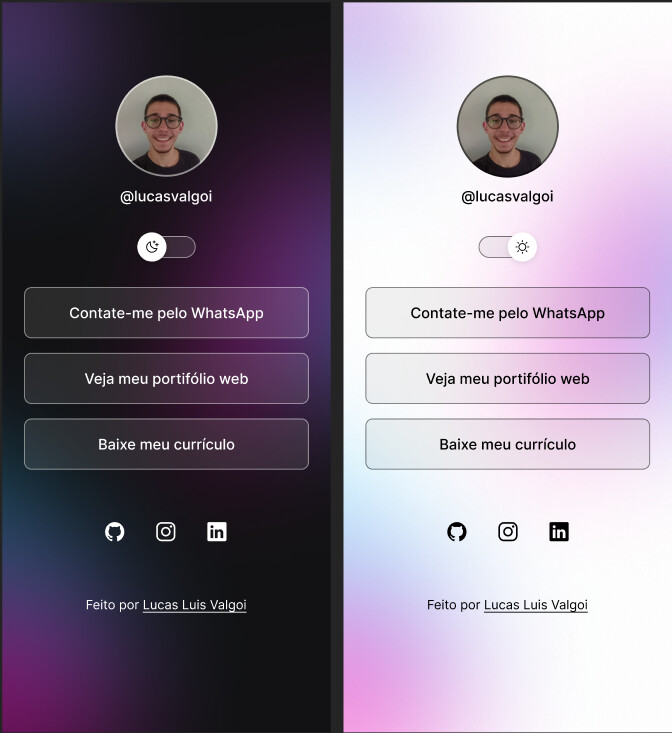

# 📌 DevLinks

<p align='center'>
   
</p>

Repositório do projeto **DevLinks**, uma página de links úteis para desenvolvedores, criada durante o *curso Discover* da Rocketseat.

> Um agregador de links simples e eficiente para acesso rápido a recursos essenciais de desenvolvimento.

---

## 🔍 Sobre o Projeto

DevLinks é um projeto front‑end que reúne diversos links frequentemente usados por desenvolvedores, organizados de forma clara e acessível. O projeto foi desenvolvido com **HTML5**, **CSS3** e **JavaScript** como parte dos aprendizados do curso *Discover* da Rocketseat, com foco em boas práticas de estrutura, estilo e interatividade.

---

## 🚀 Tecnologias Utilizadas

O projeto foi desenvolvido com as seguintes tecnologias:

✨ **HTML5** — estrutura semântica da aplicação  
🎨 **CSS3** — estilos personalizados e layout responsivo  
⚙️ **JavaScript** — lógica de interação e dinamismo  
🔧 **Git&GitHub** — versionamento de código

---

## 📂 Estrutura do Projeto

```
📦 DevLinks
 ┣ 📂 assets/
 ┣ 📜 index.html
 ┣ 📜 style.css
 ┣ 📜 script.js
 ┣ 📜 README.md
```

---

## 📋 Funcionalidades

✅ Lista de links úteis para desenvolvedores  
✅ Interface simples e responsiva  
✅ Visual limpo com categorias de links  
✅ Facilidade para personalizar e expandir  

---

## 🙌 Agradecimentos

✨ Criado com ❤️ durante o curso **Discover – Rocketseat**.
